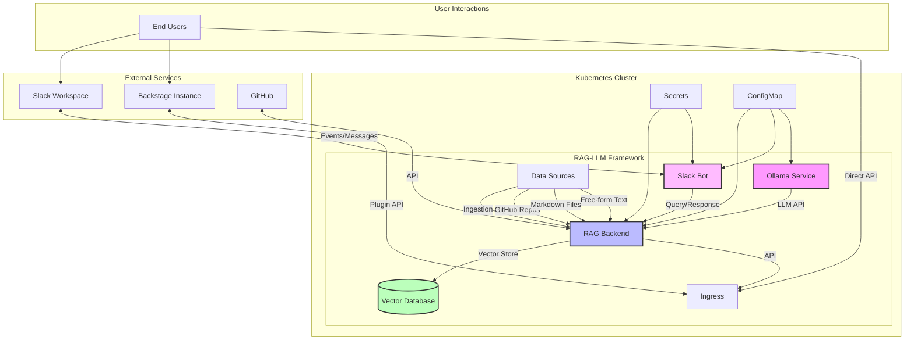

# RAG-LLM Framework Architecture

This document provides a detailed overview of the RAG-LLM Framework architecture, explaining how the various components interact with each other.

## System Architecture Diagram

## Component Details

### Core Components

1. **Ollama Service**
   - Hosts and serves the LLM model
   - Provides inference API for the RAG Backend
   - Supports multiple models (llama2, mistral, gemma, etc.)

2. **RAG Backend**
   - Orchestrates the RAG workflow using LangChain
   - Manages data ingestion from various sources
   - Processes queries and retrieves relevant context
   - Generates responses using the LLM

3. **Vector Database**
   - Stores document embeddings for efficient retrieval
   - Implements similarity search for context retrieval
   - Persists data across restarts

### Integration Components

4. **Slack Bot**
   - Connects to Slack using the Bolt framework
   - Listens for messages and mentions
   - Forwards queries to the RAG Backend
   - Collects user feedback

5. **Backstage Plugin**
   - Provides a chat interface within Backstage
   - Connects to the RAG Backend API
   - Displays responses with source references
   - Collects user feedback

### Infrastructure Components

6. **Ingress**
   - Exposes the RAG Backend API
   - Routes traffic to the appropriate services
   - Handles TLS termination

7. **Secrets**
   - Stores sensitive configuration
   - Manages API tokens and credentials
   - Supports .env file for local development

8. **ConfigMap**
   - Stores non-sensitive configuration
   - Configures RAG parameters
   - Sets up LLM model parameters

## Data Flow

1. **Data Ingestion Flow**
   - Data sources (GitHub, files, text) → RAG Backend
   - RAG Backend chunks and processes data
   - Embeddings are generated and stored in Vector Database

2. **Query Flow**
   - User query → Slack Bot or Backstage Plugin
   - Query → RAG Backend
   - RAG Backend retrieves context from Vector Database
   - Context + Query → Ollama LLM
   - Response → User

3. **Feedback Flow**
   - User feedback → Slack Bot or Backstage Plugin
   - Feedback → RAG Backend
   - Feedback stored for analysis and improvement

## Deployment Architecture

The RAG-LLM Framework is deployed as a set of containerized services in Kubernetes:

- Each component runs in its own pod
- Persistent volumes for Vector Database and Ollama models
- Services for internal communication
- Ingress for external access
- Secrets and ConfigMaps for configuration

This architecture provides:
- Scalability: Components can be scaled independently
- Resilience: Self-healing capabilities
- Flexibility: Easy to update or replace components
- Portability: Consistent deployment across environments
